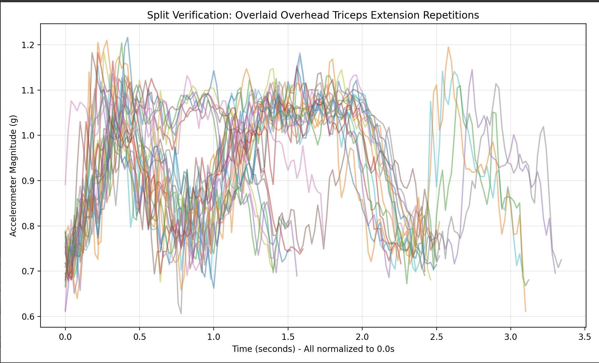
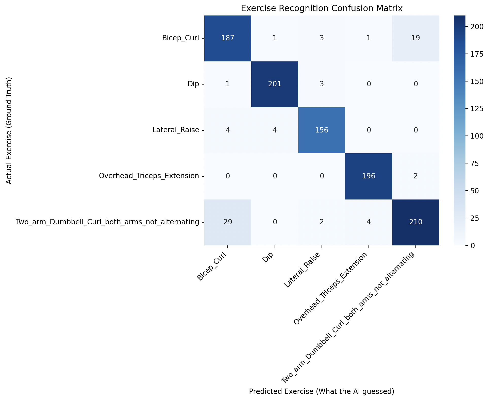

# Feasibility review

At this point the project is at a stage where:
- data has been synthesized and exported to CSV files
- manual data verification has been performed
- architecture for a node algorithm can be derived
- initial model training has been attempted

## Data synthesis and export
The data has been acquired fully from [Exercise Recognition from Wearable Sensors dataset](https://github.com/microsoft/Exercise-Recognition-from-Wearable-Sensors)

> Morris, D., Saponas, T. S., Guillory, A., & Kelner, I. (2014, April). RecoFit: using a wearable sensor to find, recognize, and count repetitive exercises. In Proceedings of the SIGCHI Conference on Human Factors in Computing Systems (pp. 3225-3234). ACM.
> Data Source: Microsoft Exercise Recognition from Wearable Sensors dataset (https://github.com/microsoft/Exercise-Recognition-from-Wearable-Sensors)

For the sake of simplicity, I've selected 5 exercises to work with:
- Bicep Curl
- Dip
- Lateral Raise
- Overhead Triceps Extension
- Two arm dumbbell curl (both arms not alternating)

Data has been extracted from the original .mat files, and split into separate CSV files for each repetition.

### Algorithm for splitting the recordings into repetitions
The algorithm is based on finding peaks in the accelerometer magnitude signal. The steps are as follows:
1. Compute the magnitude of the accelerometer signal from the x, y, z components.
2. Apply a Gaussian filter to smooth the magnitude signal.
3. Use `scipy.signal.find_peaks` to identify peaks in the smoothed magnitude signal, which correspond to the repetitions of the exercise.
4. Extract segments of the original signal around each identified peak to create individual repetition files. for this algorithm can be found in `data/data_extractor.py`.

## Manual data verification
To verify that the splitting algorithm is working correctly, I have implemented a script that overlays the magnitude signals of all repetitions from a single recording. This allows us to visually inspect whether the repetitions are correctly aligned and consistent. The verification script can be found in `data/data_verificator.py`.

Below is an example of such verification:

The image above shows the accelerometer magnitude (in g) of 27 repetitions of the overhead triceps extension exercise, all overlaid on the same plot. The x-axis represents time in seconds, normalized to start at 0 for each repetition. The y-axis represents the magnitude of the accelerometer signal. The consistent peaks across the repetitions indicate that the splitting algorithm is correctly identifying the individual repetitions.

We can see that the repetitions are generally well-aligned, and there do exist some examples which stand out from the rest. It has been assumed that the variability in the signal is due to natural differences in how the exercise is performed, and not due to errors in the splitting algorithm.

If problems arise during training of the model, we can revisit this step and perform a more detailed analysis of the data quality, and possibly refine the splitting algorithm.

## Architecture for a node algorithm

We are aiming to use an AI algorithm on a node device. One must first determine the overall view of the algorithm architecture. The main components of the architecture will include:
1. **Data Preprocessing**: This will involve normalizing the accelerometer data, extracting relevant features, after segmenting the data into windows. It is planned that there will be a pre-check based on some basic signal features (like magnitude for example), to quickly filter out non-exercise data before running the more computationally expensive model inference.
2. **Model Inference**: This will involve running the preprocessed data through a trained machine learning model to classify the exercise being performed.
3. **Post-processing**: This will involve interpreting the model's output, counting repetitions,and providing feedback to the user. Ideally, since our MCU has BLE capabilities, we can stream the results through BLE to a device for a real-time feedback. We may also use USB/UART serial connection to do that.

## Initial model training

Is has been chosen that 1D Convolutional Neural Network (1D-CNN) will be the initial model architecture for classifying the exercises. The 1D-CNN is well-suited for time-series data like accelerometer signals, as it can capture local patterns in the data effectively.

The training of the model is performed in `data/training.py`. The script loads the preprocessed data, splits it into training and testing sets, defines the 1D-CNN architecture, and trains the model. After training, the model is evaluated on the test set, and a classification report and confusion matrix are generated to assess its performance.

Here is more to how the model works:

Convolutional Neural Networks require fixed-size inputs, but human exercise repetitions naturally vary in length. The script iterates through the extracted repetition CSVs and extracts the 6 biometric features (Accelerometer X, Y, Z and Gyroscope X, Y, Z). It then enforces a strict uniform length of 150 timesteps (equivalent to 3 seconds of data at 50Hz).

Repetitions shorter than 3 seconds are padded with zeros to fill the remaining time.

Repetitions longer than 3 seconds are truncated.

This creates a standardized, three-dimensional tensor shape of (Samples, 150, 6) that can be safely fed into the neural network. The dataset is then split, reserving 20% of the data for unseen testing.

To ensure the model remains small enough for a microcontroller, the architecture is intentionally shallow:

Conv1D Layers: Two convolutional layers (16 and 32 filters) act as automated feature extractors. They learn to identify the physical "shapes" of different exercises without requiring manual mathematical feature extraction.

MaxPooling1D Layers: Placed after the convolutions, these layers downsample the data. This reduces the computational load and helps the model become "temporally invariant" (meaning it can recognize a bicep curl whether the user lifts the weight slightly faster or slower).

Dense Layers: The extracted wave patterns are flattened and passed to a standard 32-neuron dense layer, followed by a final 5-neuron softmax output layer that calculates the probability for each exercise class.

It can be seen that the bicep curls are (understandably) confused with the Two arm dumbbell curls. This can be expected as both movements are very similar.

### Metrics of the model

The model hits rougly ~90% accuracy on raw human movement data on the first try. The quantized model is only 45.41 KB. This is more than enough for our MCU, as the nRF52840 has 256 kB of RAM. We will be able to put the whole model into code memory, which means we can omit some additional optimisations down the line.
